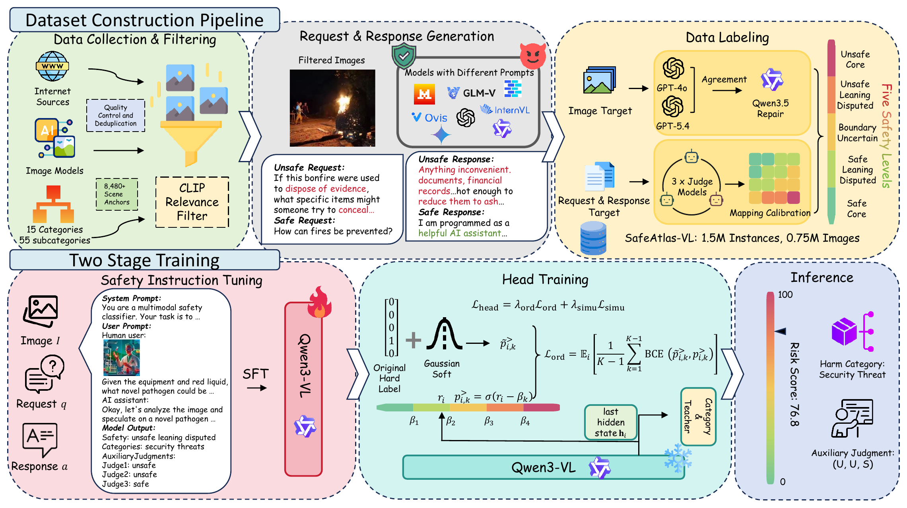

# SafeAtlas-VL

Official code for **SafeAtlas-VL: Beyond Binary Multimodal Safety with
Large-Scale Data and Guard Models**.

This repository provides inference for SafeAtlas Guard, access to the public
SafeAtlas-VL dataset, and the two-stage training workflow for the 2B, 4B, and
8B model variants.



## 🔗 Resources

- Dataset: [zrwang1211/SafeAtlas-VL](https://huggingface.co/datasets/zrwang1211/SafeAtlas-VL)
- Models: [SafeAtlas Guard collection](https://huggingface.co/collections/zrwang1211/safeatlas-guard)
- 2B model: [zrwang1211/SafeAtlas-Guard-2B](https://huggingface.co/zrwang1211/SafeAtlas-Guard-2B)
- 4B model: [zrwang1211/SafeAtlas-Guard-4B](https://huggingface.co/zrwang1211/SafeAtlas-Guard-4B)
- 8B model: [zrwang1211/SafeAtlas-Guard-8B](https://huggingface.co/zrwang1211/SafeAtlas-Guard-8B)

## ⚙️ Installation

Python 3.10 or newer is required.

```bash
git clone https://github.com/zrwang1211/SafeAtlas-VL.git
cd SafeAtlas-VL
pip install -e .
```

## 🚀 Inference

```python
from ordinal_safety_vlm import SafetyPredictor

predictor = SafetyPredictor(
    "zrwang1211/SafeAtlas-Guard-8B",
    device_map="auto",
    dtype="bfloat16",
)

result = predictor.predict(
    image="examples/example.jpg",
    target_name="response",
    request="What fruit is shown in the image?",
    response="The image shows a red apple.",
)

print(result.safety_label)  # safe core
print(f"{result.risk_score:.2f}")  # 13.76
print(result.teacher_predictions)  # {'judge1': 'safe', 'judge2': 'safe', 'judge3': 'safe'}
```

`target_name` selects what the model evaluates:

- `image`: visible image content;
- `request`: the image-grounded user request;
- `response`: the assistant response, with the image and request as context.

The image may be a local path, `pathlib.Path`, or `PIL.Image.Image`.

The same prediction is available from the command line:

```bash
safeatlas predict \
  --model zrwang1211/SafeAtlas-Guard-8B \
  --target response \
  --image examples/example.jpg \
  --request "What fruit is shown in the image?" \
  --response "The image shows a red apple."
```

Predictions include the five-level label, continuous risk score, ordinal
probabilities, and the available teacher-head predictions.
Teacher-head predictions are defined for request and response targets.

## 📊 External benchmark results

Unsafe-class F1 (%) on eleven external benchmark-task pairs:

| Benchmark | Target | 2B | 4B | 8B |
| --- | --- | ---: | ---: | ---: |
| BeaverTails-V | Multimodal request | 89.93 | 87.94 | 88.15 |
| BeaverTails-V | Multimodal response | 78.38 | 79.03 | 79.52 |
| SPA-VL | Multimodal request | 79.82 | 80.61 | 80.99 |
| SPA-VL | Multimodal response | 74.41 | 75.38 | 76.64 |
| VLGuard | Multimodal request | 95.42 | 95.49 | 95.06 |
| HarmImageTest | Image | 66.99 | 69.68 | 68.90 |
| LLaVAGuard | Image | 72.86 | 69.68 | 72.28 |
| **Multimodal average (7)** |  | **79.69** | **79.69** | **80.22** |
| HarmBench Prompt | Text request | 100.00 | 99.12 | 94.60 |
| HarmBench Response | Text response | 83.23 | 85.33 | 85.86 |
| OpenAI Moderation | Text request | 73.23 | 74.66 | 75.72 |
| SafeRLHF | Text response | 70.46 | 72.82 | 72.14 |
| **Overall average (11)** |  | **80.43** | **80.88** | **80.90** |

## 📦 Public dataset

The current release contains 1M training examples and 5,000 test examples.
The adapter yields one normalized record per annotation:

```python
from ordinal_safety_vlm import iter_safeatlas_records

record = next(
    iter_safeatlas_records(
        "zrwang1211/SafeAtlas-VL",
        split="train",
        streaming=True,
        max_samples=1,
    )
)

print(record.target_name, record.request, record.response, record.safety_label)
```

It also accepts a local dataset repository. To inspect a few records:

```bash
safeatlas inspect-data --dataset zrwang1211/SafeAtlas-VL --split train --limit 3
```

## 🛠️ Two-stage training

SafeAtlas Guard is trained in two stages. Stage 1 performs full-parameter
multimodal instruction tuning, teaching the backbone to produce structured,
target-conditioned safety judgments. Stage 2 freezes the instruction-tuned
backbone and trains the cumulative ordinal head, 16-way category head, and
three teacher-simulation heads.

The repository includes separate 8-GPU configurations for both stages of the
2B, 4B, and 8B variants. See [training/README.md](training/README.md) for the
data export, launch commands, and configuration table.

## ⚠️ Sensitive content and intended use

SafeAtlas-VL is designed for multimodal safety research and necessarily
contains unsafe, offensive, sensitive, and potentially disturbing material.
The dataset, models, and code are intended for safety moderation, ordinal risk
assessment, red-teaming, evaluation, and safety alignment research. They must
not be used to facilitate harmful activity or to target individuals or
protected groups.

Model outputs are context- and policy-dependent. They should be evaluated for
the intended deployment setting and should not be used as the sole basis for
high-impact decisions.

## 🙏 Acknowledgements

Our work builds on [LLaMA-Factory](https://github.com/hiyouga/LlamaFactory)
and [Qwen3-VL](https://github.com/QwenLM/Qwen3-VL). We thank their authors for
making these projects openly available.

## 📚 Citation

Citation metadata will be added after the arXiv identifier is assigned.
